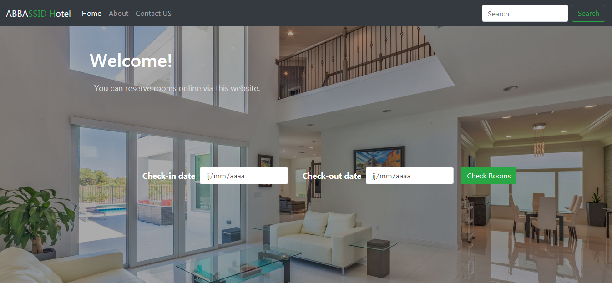
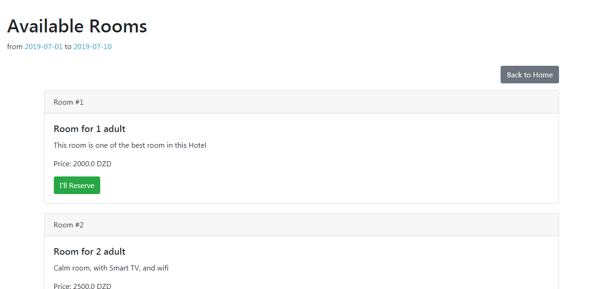
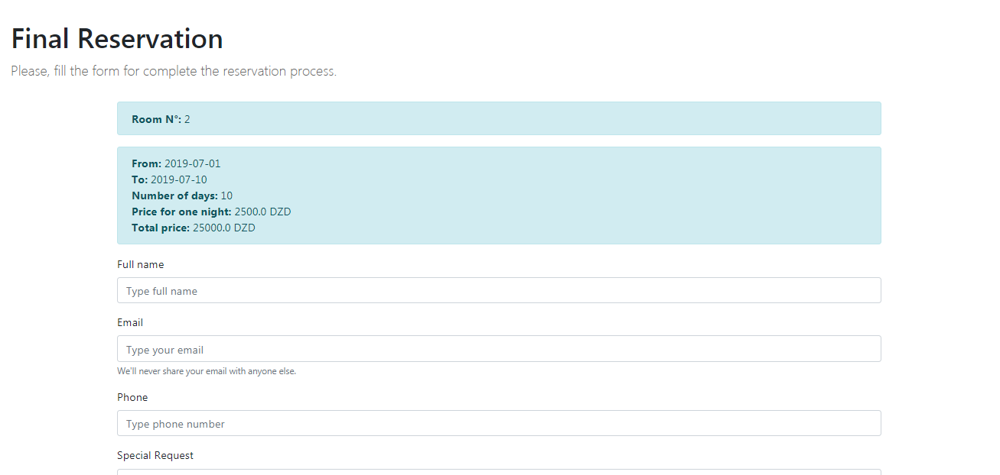

# Hotel Reservation System
A web application to book a room in a hotel, a customer must check the application to see if there is an empty room, the duration of the reservation and the overall cost ..etc. by introducing personal information.

### Features 💡
* Very simple to use (UX Design)
* Responsive design
* Online hotel reservation

### Report
* [Architecture and Software Development - PDF Version](Report.pdf)

### Screenshoot
Home           |
:--------------:|
 |

Available rooms    |
:-----------------:|
 |

Reservation       |
:----------------:|
 |

### Used Languages
* Java
* HTML
* CSS
* JavaScript

### Used Technologies & Frameworks
* JavaEE (JSP, Servlet, EJB)
* Bootstrap

### Used Database
* MySQL

### Used server
* GlassFish 5.0

### Installation 🔌
1. Press the **Fork** button (top right the page) to save copy of this project on your account.
2. Download the repository files (project) from the download section or clone this project by typing in the bash the following command:

       git clone https://github.com/HouariZegai/HotelReservationSystem.git
3. Download the glassFish server or any other server (support EJB) like JBOSS or other, and add it to the used IDE.
4. Import & execute the SQL queries from the Database folder to the MySQL database.
5. Import the project in Netbeans or any other IDE.
6. Deploy & Run the application :D

### Contributing 🔧
If you want to contribute to this project and make it better with new ideas, your pull request is very welcomed.
If you find any issue just put it in the repository issue section, thank you.

.سبحَانَكَ اللَّهُمَّ وَبِحَمْدِكَ، أَشْهَدُ أَنْ لا إِلهَ إِلأَ انْتَ أَسْتَغْفِرُكَ وَأَتْوبُ إِلَيْكَ
